# Revisi Struktur Database PKM Center Unila

> Status: **diterapkan ke backend (model + migrasi)** — tanggal 09-10-2026
> Sumber ERD: revisi "Digitalisasi Manajemen PKM" (diberikan sebagai mermaid erDiagram)
> DDL implementasi: [`backend/migrations/0001_init_pkm_schema.sql`](../backend/migrations/0001_init_pkm_schema.sql)
> Target DB: PostgreSQL 16 (`postgres:16-alpine`, lihat `docker-compose.yml`)

Dokumen ini melengkapi `rencana-awal-proyek-pkm-center-unila.md` (bagian 5 & Fase 3) dan
`daftar-fitur-pkm-center-unila.md` (Fitur Lanjutan). Skema baru ini adalah fondasi untuk
fitur lanjutan: login mahasiswa, submit & tracking proposal, dashboard reviewer/dosen,
notifikasi — yang selama ini bertanda `[ ]` di daftar fitur.

Hasil validasi DDL: **33 tabel + 1 view**, **48 foreign key**, diuji nyata pada
`postgres:16-alpine` (semua `CREATE TABLE` sukses, seed `roles` & 9 skema PKM terpasang).

---

## 0. Ringkasan: apa yang berubah & apa yang hilang

Skema lama (MVP) hanya punya **8 tabel** yang datar:

| Tabel lama (GORM) | Isi |
|---|---|
| `users` | user + kolom `role` berupa string |
| `contents` | berita + video + galeri dalam satu tabel (`type`) |
| `timelines` | tahapan PKM per tahun |
| `pedoman` | dokumen panduan per tahun |
| `portfolios` | arsip proposal lolos pendanaan (teks bebas) |
| `feedbacks` | kritik & saran + pesan kontak |
| `scheme_stats` | jumlah usulan per skema |
| `contact_infos` | info kontak (baris tunggal) |

Skema baru memecahnya menjadi **±34 tabel** yang ternormalisasi. **Penting:** beberapa tabel
lama **tidak digantikan 1:1** oleh ERD. Ringkasan lengkap ada di bagian 3, tetapi intinya:

- **Digantikan penuh:** `users`, `timelines`, `pedoman`, `portfolios`.
- **Digantikan sebagian:** `contents` (hanya berita → `content_posts`; video/galeri **tidak** ada
  padanannya di ERD → ditampung `content_media`).
- **Tidak punya padanan sama sekali:** `feedbacks`, `scheme_stats`, `contact_infos`
  → diintegrasikan sebagai `feedbacks`, `v_scheme_stats` (view), dan `contact_infos`.
  Tanpa ini, fitur **Masukan**, **Statistik skema**, dan **Kontak** akan hilang.

---

## 1. ERD (mermaid)

```mermaid
erDiagram
    USERS {
        uuid id PK
        string email UK
        string password_hash
        string full_name
        string phone
        string account_status
        string auth_provider
        datetime email_verified_at
        datetime last_login_at
        datetime created_at
        datetime updated_at
    }
    ROLES {
        bigint id PK
        string code UK
        string name
        string description
    }
    USER_ROLES {
        uuid user_id PK, FK
        bigint role_id PK, FK
        datetime assigned_at
    }
    STUDENT_PROFILES {
        uuid user_id PK, FK
        string student_number UK
        string faculty
        string department
        string study_program
        int entry_year
        decimal gpa
        string academic_status
        text biography
    }
    LECTURER_PROFILES {
        uuid user_id PK, FK
        string lecturer_number UK
        string faculty
        string department
        string study_program
        string academic_position
        text biography
        int supervision_capacity
    }
    EXPERTISE_FIELDS {
        bigint id PK
        string name UK
        string description
    }
    USER_EXPERTISE {
        uuid user_id PK, FK
        bigint expertise_id PK, FK
        string expertise_level
    }
    ACHIEVEMENTS {
        uuid id PK
        uuid student_id FK
        string title
        string category
        string organizer
        string achievement_level
        string rank
        date achievement_date
        string certificate_url
        string verification_status
        datetime created_at
    }
    PKM_PERIODS {
        uuid id PK
        string name
        int year
        date registration_start
        date registration_end
        string status
        datetime created_at
    }
    PKM_SCHEMES {
        bigint id PK
        string code UK
        string name
        text description
        int min_members
        int max_members
        bool is_active
    }
    PKM_STAGES {
        uuid id PK
        uuid period_id FK
        string name
        int stage_order
        date start_date
        date end_date
        string status
        text description
    }
    TEAMS {
        uuid id PK
        uuid period_id FK
        uuid leader_id FK
        string name
        string status
        datetime created_at
    }
    TEAM_MEMBERS {
        uuid team_id PK, FK
        uuid student_id PK, FK
        string member_role
        string invitation_status
        datetime joined_at
    }
    TEAM_INVITATIONS {
        uuid id PK
        uuid team_id FK
        uuid sender_id FK
        uuid recipient_id FK
        text message
        string status
        datetime responded_at
        datetime created_at
    }
    PROPOSALS {
        uuid id PK
        uuid team_id FK
        bigint scheme_id FK
        uuid period_id FK
        string title
        text abstract
        text keywords
        string status
        uuid current_stage_id FK
        bool is_funded
        datetime submitted_at
        datetime created_at
        datetime updated_at
    }
    PROPOSAL_DOCUMENTS {
        uuid id PK
        uuid proposal_id FK
        int version_number
        string file_name
        string file_url
        uuid uploaded_by FK
        text change_notes
        datetime uploaded_at
    }
    SUPERVISOR_REQUESTS {
        uuid id PK
        uuid proposal_id FK
        uuid lecturer_id FK
        uuid requested_by FK
        text request_message
        string status
        text response_message
        datetime responded_at
        datetime created_at
    }
    PROPOSAL_SUPERVISORS {
        uuid proposal_id PK, FK
        uuid lecturer_id PK, FK
        bool is_primary
        datetime assigned_at
    }
    GUIDANCE_SESSIONS {
        uuid id PK
        uuid proposal_id FK
        uuid lecturer_id FK
        datetime scheduled_at
        string location
        string meeting_url
        string status
        text agenda
        text meeting_notes
    }
    PROPOSAL_FEEDBACK {
        uuid id PK
        uuid proposal_id FK
        uuid document_id FK
        uuid author_id FK
        string feedback_type
        text comment
        bool requires_revision
        datetime created_at
    }
    REVIEW_ASSIGNMENTS {
        uuid id PK
        uuid proposal_id FK
        uuid reviewer_id FK
        uuid assigned_by FK
        string status
        date review_deadline
        datetime assigned_at
    }
    REVIEWS {
        uuid id PK
        uuid assignment_id FK
        decimal total_score
        text strengths
        text weaknesses
        text comments
        string recommendation
        string review_status
        datetime submitted_at
    }
    REVIEW_CRITERIA {
        bigint id PK
        bigint scheme_id FK
        string name
        text description
        decimal max_score
        decimal weight
    }
    REVIEW_SCORES {
        uuid review_id PK, FK
        bigint criterion_id PK, FK
        decimal score
        text comment
    }
    LOGBOOK_ENTRIES {
        uuid id PK
        uuid proposal_id FK
        uuid student_id FK
        date activity_date
        string title
        text activity_description
        text progress_result
        text obstacle
        text next_plan
        string attachment_url
        string verification_status
        datetime created_at
    }
    LOGBOOK_COMMENTS {
        uuid id PK
        uuid logbook_id FK
        uuid author_id FK
        text comment
        datetime created_at
    }
    AI_ANALYSES {
        uuid id PK
        uuid requested_by FK
        uuid proposal_id FK
        string analysis_type
        text input_text
        text output_text
        decimal confidence_score
        string model_name
        datetime created_at
    }
    CONTENT_POSTS {
        uuid id PK
        uuid author_id FK
        string content_type
        string title
        string slug UK
        text summary
        text content
        string cover_image_url
        string status
        datetime published_at
        datetime created_at
    }
    GUIDELINES {
        uuid id PK
        uuid period_id FK
        string title
        string file_url
        int version_number
        bool is_active
        datetime published_at
    }
    NOTIFICATIONS {
        uuid id PK
        uuid user_id FK
        string notification_type
        string title
        text message
        string target_url
        bool is_read
        datetime created_at
    }

    USERS ||--o{ USER_ROLES : has
    ROLES ||--o{ USER_ROLES : assigned
    USERS ||--o| STUDENT_PROFILES : has
    USERS ||--o| LECTURER_PROFILES : has
    USERS ||--o{ USER_EXPERTISE : has
    EXPERTISE_FIELDS ||--o{ USER_EXPERTISE : classifies
    USERS ||--o{ ACHIEVEMENTS : owns
    PKM_PERIODS ||--o{ PKM_STAGES : contains
    PKM_PERIODS ||--o{ TEAMS : hosts
    PKM_PERIODS ||--o{ PROPOSALS : contains
    PKM_PERIODS ||--o{ GUIDELINES : publishes
    PKM_SCHEMES ||--o{ PROPOSALS : categorizes
    PKM_SCHEMES ||--o{ REVIEW_CRITERIA : defines
    USERS ||--o{ TEAMS : leads
    TEAMS ||--o{ TEAM_MEMBERS : consists_of
    USERS ||--o{ TEAM_MEMBERS : joins
    TEAMS ||--o{ TEAM_INVITATIONS : sends
    USERS ||--o{ TEAM_INVITATIONS : receives
    TEAMS ||--o{ PROPOSALS : submits
    PKM_STAGES ||--o{ PROPOSALS : current_stage
    PROPOSALS ||--o{ PROPOSAL_DOCUMENTS : has_versions
    USERS ||--o{ PROPOSAL_DOCUMENTS : uploads
    PROPOSALS ||--o{ SUPERVISOR_REQUESTS : requests
    USERS ||--o{ SUPERVISOR_REQUESTS : receives
    PROPOSALS ||--o{ PROPOSAL_SUPERVISORS : supervised_by
    USERS ||--o{ PROPOSAL_SUPERVISORS : supervises
    PROPOSALS ||--o{ GUIDANCE_SESSIONS : schedules
    USERS ||--o{ GUIDANCE_SESSIONS : facilitates
    PROPOSALS ||--o{ PROPOSAL_FEEDBACK : receives
    USERS ||--o{ PROPOSAL_FEEDBACK : authors
    PROPOSALS ||--o{ REVIEW_ASSIGNMENTS : assigned_for
    USERS ||--o{ REVIEW_ASSIGNMENTS : reviews
    REVIEW_ASSIGNMENTS ||--o| REVIEWS : produces
    REVIEWS ||--o{ REVIEW_SCORES : contains
    REVIEW_CRITERIA ||--o{ REVIEW_SCORES : measured_by
    PROPOSALS ||--o{ LOGBOOK_ENTRIES : records
    USERS ||--o{ LOGBOOK_ENTRIES : writes
    LOGBOOK_ENTRIES ||--o{ LOGBOOK_COMMENTS : receives
    USERS ||--o{ LOGBOOK_COMMENTS : authors
    USERS ||--o{ AI_ANALYSES : requests
    PROPOSALS ||--o{ AI_ANALYSES : analyzed
    USERS ||--o{ CONTENT_POSTS : writes
    USERS ||--o{ NOTIFICATIONS : receives
```



> Relasi & kolom tabel tambahan (`content_media`, `feedbacks`, `contact_infos`) tidak
> digambarkan di atas: lihat bagian 4.

---

## 2. Katalog tabel per domain

Format: **nama tabel** — kunci & catatan penting. Detail tipe/constraint ada di file SQL.

### 2.1 Autentikasi & pengguna (RBAC)
- **`roles`** — `id` bigint, `code` unik (`admin`, `mahasiswa`, `dosen`, `reviewer`, `pimpinan`).
- **`users`** — PK UUID, `email` unik, `password_hash`, `full_name`, `account_status`, `auth_provider`,
  verifikasi email, `last_login_at`. Menggantikan `users` lama (kolom `role` string → tabel relasi).
- **`user_roles`** — pivot `(user_id, role_id)`, mendukung multi-role.
- **`student_profiles`** — 1:1 opsional ke `users`: NPM unik, fakultas/prodi, angkatan, IPK.
- **`lecturer_profiles`** — 1:1 opsional: NIDN/NIP unik, jabatan akademik, kapasitas bimbingan.
- **`expertise_fields`** + **`user_expertise`** — bidang keahlian & level per user.
- **`achievements`** — prestasi mahasiswa + status verifikasi.

### 2.2 Master PKM
- **`pkm_periods`** — periode PKM per tahun + jendela pendaftaran + status.
- **`pkm_schemes`** — skema (PKM-K … PKM-RSH), batas `min_members`/`max_members`.
- **`pkm_stages`** — tahapan di dalam periode (sosialisasi → submit → review → penetapan →
  pelaksanaan → PIMNAS), dengan urutan & rentang tanggal. Punya `UNIQUE (id, period_id)`
  sebagai target FK komposit.

### 2.3 Tim
- **`teams`** — tim per periode, diketuai `leader_id`. Punya `UNIQUE (id, period_id)`.
- **`team_members`** — anggota tim + status undangan.
- **`team_invitations`** — undangan bergabung (sender/recipient/message/status).

### 2.4 Proposal & bimbingan
- **`proposals`** — inti: tim + skema + periode, status, `current_stage_id`, `is_funded`.
  Dilengkapi 2 FK komposit integritas periode (lihat bagian 5).
- **`proposal_documents`** — versi berkas proposal (`version_number` unik per proposal).
- **`supervisor_requests`** — permintaan dosen pembimbing.
- **`proposal_supervisors`** — dosen pembimbing final (+ `is_primary`).
- **`guidance_sessions`** — jadwal bimbingan (luring/daring).
- **`proposal_feedback`** — catatan/revisi/approval pada proposal & dokumen.

### 2.5 Review & penilaian
- **`review_assignments`** — penugasan proposal ke reviewer + tenggat.
- **`reviews`** — hasil review (1:1 dari assignment), skor total & rekomendasi.
- **`review_criteria`** — kriteria per skema (bobot & skor maks).
- **`review_scores`** — skor per kriteria dalam satu review.

### 2.6 Logbook kegiatan
- **`logbook_entries`** — catatan kegiatan mahasiswa per proposal + status verifikasi.
- **`logbook_comments`** — komentar/umpan balik pada logbook.

### 2.7 Analisis AI
- **`ai_analyses`** — riwayat analisis (tipe, input/output, confidence, model).

### 2.8 Konten / CMS
- **`content_posts`** — berita/artikel/pengumuman (pengganti berita di `contents`).
- **`guidelines`** — dokumen pedoman per periode + `source`/`note` (dari `pedoman` lama) + versi.
- **`notifications`** — notifikasi in-app per user.

### 2.9 Tabel tambahan terintegrasi
- **`content_media`** — video & galeri foto (bagian 4.1).
- **`feedbacks`** — kritik & saran + pesan kontak (bagian 4.2).
- **`contact_infos`** — info kontak baris tunggal (bagian 4.3).
- **`v_scheme_stats`** — VIEW statistik usulan per skema (bagian 4.4).

---

## 3. Pemetaan tabel lama → skema baru

Ini menjawab pertanyaan: **"kalau tabel lama tertimpa, apakah ada penggantinya?"**

| Tabel lama | Pengganti di skema baru | Status | Catatan migrasi |
|---|---|---|---|
| `users` | `users` + `roles` + `user_roles` (+ `student_profiles` / `lecturer_profiles`) | ✅ **Digantikan penuh** | Kolom `role` string → baris di `user_roles`. `name` → `full_name`, `password` → `password_hash` (hash bcrypt tetap valid). |
| `contents` (berita) | `content_posts` | ✅ Digantikan | `body` → `content`, `thumbnail_url` → `cover_image_url`. Perlu generate `slug` unik. |
| `contents` (video) | `content_media` (`media_type='video'`) | ✅ Ditampung | Tabel tambahan terintegrasi (ERD tidak memuat video). |
| `contents` (galeri) | `content_media` (`media_type='gallery'`) | ✅ Ditampung | Tabel tambahan terintegrasi (ERD tidak memuat galeri). |
| `timelines` | `pkm_periods` + `pkm_stages` | ✅ Digantikan | `year` → `pkm_periods.year`; tiap `stage` → baris `pkm_stages` (`stage_order` = `order`). `label`/`note` → `description` + tanggal. |
| `pedoman` | `guidelines` | ✅ Digantikan | `year` → relasi `period_id`; `source` & `note` kini tersedia sebagai kolom. |
| `portfolios` | `proposals` (+ `teams`, `pkm_schemes`, `pkm_periods`) dengan `is_funded = TRUE` | ✅ Digantikan (konseptual) | Arsip lama berupa teks tim bebas; di skema baru proposal terikat tim nyata. Perlu seeding tim dummy saat migrasi. |
| `feedbacks` | `feedbacks` | ✅ Dipertahankan | Tabel tambahan terintegrasi (ERD tidak memuat feedback). |
| `scheme_stats` | VIEW `v_scheme_stats` dari `proposals` | ✅ Turunan | Angka dihitung otomatis dari `proposals` (lihat catatan bagian 8). |
| `contact_infos` | `contact_infos` | ✅ Dipertahankan | Tabel tambahan terintegrasi (ERD tidak memuat kontak). |

**Kesimpulan:** 4 tabel lama digantikan penuh, 1 digantikan sebagian, dan 3 tidak punya padanan
di ERD sehingga diintegrasikan sebagai tabel/view tambahan. Dengan `content_media`, `feedbacks`,
`contact_infos`, dan `v_scheme_stats`, **tidak ada fitur lama yang kehilangan data**.

---

## 4. Detail tabel tambahan terintegrasi

### 4.1 `content_media`
ERD baru hanya punya `content_posts` (berita/artikel). Fitur lama menyatukan berita, video, dan
galeri dalam `contents`. Berita pindah ke `content_posts`, sedangkan **video & galeri** masuk
`content_media` dengan `media_type` (`video` | `gallery`). Kolom `color` dipertahankan untuk
fallback UI, `sort_order` untuk urutan galeri.

### 4.2 `feedbacks`
Sama dengan `feedbacks` lama (`kind` = `saran` | `kontak`, `is_read`). Tetap diperlukan untuk
form Kritik & Saran (Home) dan form Kontak, serta seksi "Masukan" di panel admin.

### 4.3 `contact_infos`
Baris tunggal (`id = 1`, dijaga `CHECK (id = 1)`), berisi alamat/email/telepon/WA/sosial/media
embed peta. Sumber halaman `/#kontak` dan seksi Kontak di admin.

### 4.4 `v_scheme_stats` (view)
Pengganti `scheme_stats`. Statistik "jumlah usulan per skema" kini dihitung:
`COUNT(proposals) FILTER (WHERE status <> 'draft')` dan `COUNT(... is_funded)` per skema.
Keuntungan: angka selalu konsisten dengan data proposal, tanpa input manual.

> **Keputusan (v3): terima turunan.** Angka statistik **tidak lagi diinput manual**.
> Konsekuensi: tabel `scheme_stats` dihapus dari skema target, endpoint
> `PUT /api/admin/stats` dihapus, dan seksi "Statistik" di panel admin menjadi
> **read-only** (hanya menampilkan hasil `v_scheme_stats`).

---

## 5. Konvensi & keputusan desain

- **PK**: UUID (`gen_random_uuid()`) untuk entitas transaksional; BIGINT identity untuk tabel
  referensi kecil (`roles`, `pkm_schemes`, `review_criteria`, `expertise_fields`).
- **Enum**: `varchar` + `CHECK` (bukan tipe `ENUM` PG) agar mudah dipetakan ke GORM dan diubah.
- **Waktu**: `TIMESTAMPTZ` (timezone-aware) untuk `datetime`; `DATE` untuk tanggal murni.
- **Uang/skor/decimal**: `NUMERIC` (mis. `gpa NUMERIC(3,2)`, `total_score NUMERIC(6,2)`).
- **On delete**: `CASCADE` untuk child/join yang bergantung orang tua, `SET NULL` untuk referensi
  opsional (mis. `uploaded_by`, `author_id`), `RESTRICT` untuk master yang tak boleh dihapus
  bila masih dipakai (mis. `pkm_schemes`, `pkm_periods` pada tim).
- **Unik**: email, `student_number`, `lecturer_number`, `slug`, `(proposal_id, version_number)`,
  `reviews.assignment_id` (1:1), dan semua PK komposit.
- **Index**: FK utama dan kolom filter (`status`, `is_read`, `media_type`) diberi index.
- **CHECK tambahan**: tanggal (`end_date >= start_date`), angka non-negatif (skor, bobot, IPK ≤ 4).

### 5.1 Integritas lintas-periode (FK komposit)
Dua aturan integritas yang tidak bisa dijamin oleh FK sederhana ditegakkan di level DB:

1. `proposals.current_stage_id` **wajib milik periode proposal**:
   ```sql
   FOREIGN KEY (current_stage_id, period_id)
       REFERENCES pkm_stages (id, period_id) ON DELETE RESTRICT
   ```
   `MATCH SIMPLE` (default) → saat `current_stage_id` NULL, constraint dilewati.
   `ON DELETE RESTRICT` mencegah penghapusan tahapan yang masih jadi tahap aktif.
2. `proposals` **wajib memakai tim dari periode yang sama**:
   ```sql
   FOREIGN KEY (team_id, period_id)
       REFERENCES teams (id, period_id) ON DELETE CASCADE
   ```

Keduanya didukung `UNIQUE (id, period_id)` pada `pkm_stages` dan `teams`.

---

## 6. Cara memakai DDL

Jalankan terhadap database `pkmcenter` (PostgreSQL 16). DDL bersifat idempoten
(`IF NOT EXISTS` / `ON CONFLICT DO NOTHING`), aman dijalankan ulang.

**Opsi A — langsung ke container Docker:**
```bash
docker compose up -d db
docker compose exec -T db \
  psql -U pkm -d pkmcenter < backend/migrations/0001_init_pkm_schema.sql
```

**Opsi B — migrasi otomatis saat startup (rekomendasi):**
Pindahkan eksekusi file `backend/migrations/*.sql` ke `config.Database()` / `main.go`
setelah koneksi DB dibuat, lalu nonaktifkan `AutoMigrate` untuk tabel yang sudah dikelola SQL.

Verifikasi:
```sql
SELECT table_name FROM information_schema.tables
  WHERE table_schema = 'public' ORDER BY table_name;
SELECT * FROM v_scheme_stats;
```

---

## 7. Dampak ke backend & roadmap

Skema ini **sudah diimplementasikan bertahap** ke kode Go:
1. **[SELESAI]** Model GORM v2 di `internal/models` (`user.go`, `pkm.go`, `team.go`,
   `proposal.go`, `review.go`, `logbook.go`, `cms.go`).
2. **[SELESAI]** Migrasi SQL dijalankan otomatis saat startup
   (`backend/migrations/migrations.go` + `0001_init_pkm_schema.sql`).
3. **[SELESAI]** Auth beralih ke `users` ber-UUID + `user_roles`/`roles` (peran diturunkan dari relasi).
4. **[SELESAI]** Statistik manual dihapus: model `SchemeStat`, `StatsHandler.Update`,
   `PUT /api/admin/stats`, dan editor angka di admin dibuang; `GET /api/stats` membaca
   `v_scheme_stats` (read-only). Proposal contoh di-seed agar angka terisi & konsisten.
5. **[BELUM]** Handler & endpoint fitur baru (tim, proposal, dokumen, bimbingan, review,
   logbook, notifikasi, analisis AI) serta ETL data lama (bagian 3) — menyusul.
   CMS publik masih memakai tabel transisional (`contents`, `timelines`, `pedoman`, `portfolios`).
6. **[BELUM]** Penyesuaian frontend: modul baru untuk halaman mahasiswa/dosen/reviewer.

Rekomendasi urutan: **auth+role → master periode/skema → tim → proposal+dokumen → review →
logbook → notifikasi → konten/AI**, sejalan dengan prioritas di
`daftar-fitur-pkm-center-unila.md` bagian 4.

---

## 8. Catatan & hal yang masih terbuka

- **[SELESAI v2]** Integritas `current_stage_id` ↔ periode ditegakkan via FK komposit.
- **[SELESAI v2]** `guidelines` kini punya `source` & `note` (menutup kehilangan dari `pedoman`).
- **[SELESAI v2]** Naming tambahan diselaraskan: `feedbacks`, `contact_infos`.
- **[SELESAI v3]** Statistik skema **diterima sebagai turunan** `proposals` (`v_scheme_stats`).
  Tabel `scheme_stats` dihapus; edit manual di admin dihilangkan; angka selalu konsisten
  dengan data proposal. Kode terkait (`SchemeStat`, `StatsHandler.Update`, `PUT /api/admin/stats`,
  editor angka admin) **telah dihapus** pada implementasi backend v2.
- **[TERBUKA]** Belum ada tabel berkas/lampiran generik; semua lampiran berupa URL
  (`file_url`, `attachment_url`, `certificate_url`, `cover_image_url`). Sesuai kebutuhan saat ini
  (fitur upload berkas belum ada), kolom URL dipertahankan. Bila upload masuk roadmap,
  tambahkan tabel `files` terpusat.
- **[TERBUKA]** `teams.leader_id` idealnya juga terdaftar di `team_members` — belum di-enforce
  di DB (aturan aplikasi).

---

## 9. Changelog revisi

### v4 — 09-10-2026 (implementasi backend)
- Model GORM v2 lengkap (semua tabel) + runner migrasi SQL yang dijalankan otomatis saat startup.
- Auth bermigrasi ke `users` ber-UUID + `user_roles`/`roles`; login mengembalikan peran utama.
- `GET /api/stats` & `GET /api/admin/stats` membaca `v_scheme_stats` (read-only); `PUT` dihapus;
  editor angka di panel admin diganti tampilan hanya-baca.
- Seed v2: periode 2026 + tahapan + tim demo + proposal contoh (statistik terisi konsisten).
- Divalidasi runtime pada database bersih: 37 tabel (33 v2 + 4 CMS transisional) + 1 view; login & stats OK.

### v3 — 09-10-2026 (keputusan statistik)
- **Diputuskan: statistik skema murni turunan** dari `proposals` (`v_scheme_stats`).
- Tabel `scheme_stats` dihapus dari target; edit manual admin dihilangkan; angka konsisten otomatis.
- Rencana penghapusan kode: `SchemeStat`, `StatsHandler.Update`, `PUT /api/admin/stats`, editor admin.

### v2 — 09-10-2026 (revisi sesuai kebutuhan & temuan)
- Tambah FK komposit: `proposals (team_id, period_id) → teams` dan
  `proposals (current_stage_id, period_id) → pkm_stages`, didukung `UNIQUE (id, period_id)`.
- Tambah kolom `guidelines.source` dan `guidelines.note`.
- Rename `feedback` → `feedbacks`, `contact_info` → `contact_infos` (konsisten & mudah migrasi).
- Perjelas status tabel tambahan sebagai bagian resmi skema (bukan penambal sementara).
- Divalidasi ulang di `postgres:16-alpine`: 33 tabel + 1 view, 48 FK.

### v1 — 09-10-2026 (draft awal)
- DDL awal dari ERD + tabel tambahan, pemetaan tabel lama.
